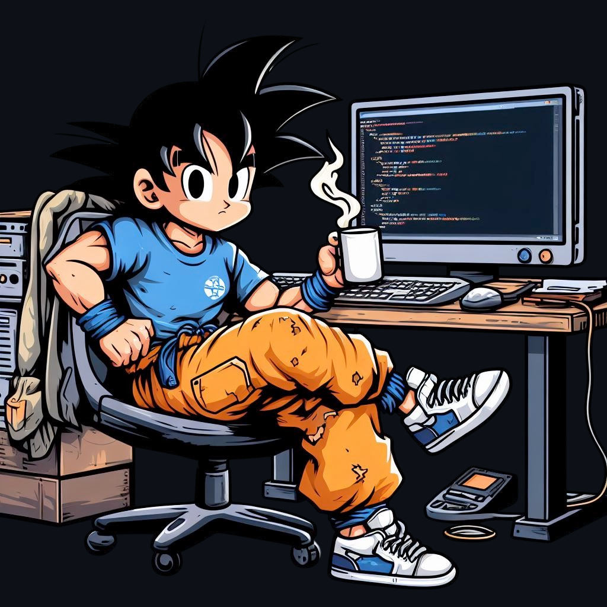
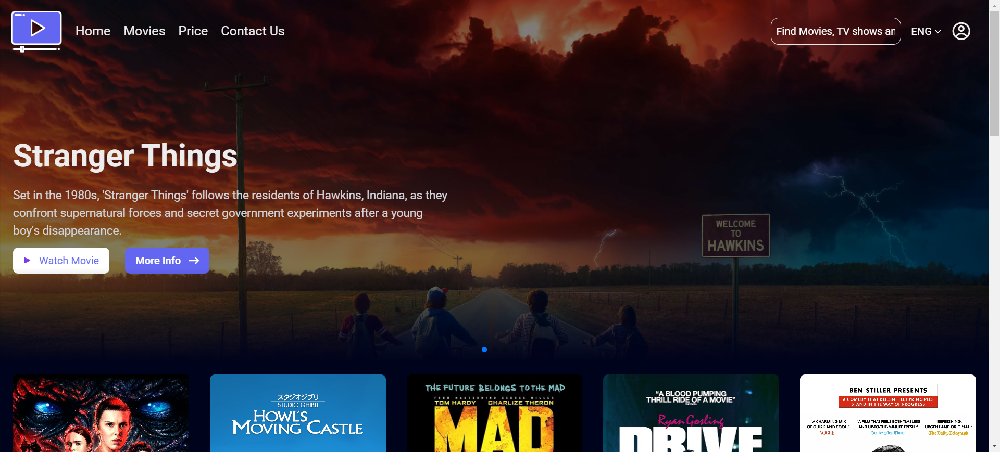
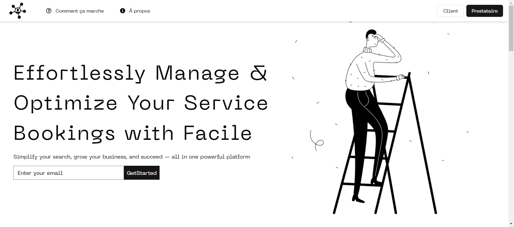

  

<!--Night Owl image-->

  

<!--Header Name-->
#  ɪ'ᴍ ʍᴏʜᴀᴍᴇᴅ ᴀᴍɪɴᴇ! 
*Digital Craftsman (Developer / Programmer)*
  

<!--Start Intro-->               
👋 Hello!
✨ I'm a dynamic Full Stack Developer and an enthusiastic IT student, fueled by a passion for coding and innovation.

💻 Coding Languages I'm Enthusiastic About:

JavaScript
PHP
Java

🌟 My Journey:
I love exploring the realms of technology, bringing ideas to life through code.

🚀 Exciting Projects:

Sleek e-commerce platforms
Captivating movie applications
Seamless reservation systems

🌐 Each project, hosted on Vercel, showcases my dedication to creating user-friendly experiences.

- ✨ Forever a student of life, I thrive on learning new skills and embracing challenges.
<!-- 💻 Dive into my [Portfolio](https://kiran1689.github.io) to see my work and the magic I've created.-->
<!--End Intro-->

<!--Profile Count Badge-->

  

---

<!--Languages and Tools Section-->       
<h2 align="center">Tᴇᴄʜ sᴛᴀᴄᴋ & Lᴀᴛᴇsᴛ Projects</h2> 
<picture>
  <source media="(prefers-color-scheme: dark)" srcset="./Skills_Animation_Dark.gif">
  <source media="(prefers-color-scheme: light)" srcset="./Skills_Animation_White.gif">
  
</picture>
 

<h3 align="left">Current Learning</h3>
<ul align="left">
  <li>Deepening my knowledge in Machine Learning and AI.</li>
  <li>Exploring advanced React.js patterns and state management techniques.</li>
  <li>Improving my skills in cloud computing with AWS and Azure.</li>
</ul>
 
 
 
  
  
 
 

<!--Latest Projects-->       

<h2 align="center">Tᴇᴄʜ sᴛᴀᴄᴋ & Lᴀᴛᴇsᴛ Projects</h2> 
    <a href="https://movies-app-eta-hazel.vercel.app/">😎MoviesApp🧑‍💻</a>
      
 <a href="https://reservatiionappfront.vercel.app/">✨ReservationApp🤯</a>
        
    <a href="https://dev.to/dev_kiran/you-should-try-these-tools-in-your-next-project-469">🫵LifeStyle Ecommerce Project OSAY</a>

  
   
   
   

---

<!--Dynamic Quote card updates everyday at 12 PM--> 
<h2 align="center">🌟 Tʜᴏᴜɢʜᴛ ᴏғ ᴛʜᴇ Dᴀʏ 🌟</h2>

<!--STARTS_HERE_QUOTE_CARD-->

    

<!--ENDS_HERE_QUOTE_CARD-->

<!--Contact Section--> 

<h2 align="center">🤝 Cᴏɴɴᴇᴄᴛ Wɪᴛʜ Mᴇ 🤝 </h2>

  

 

<!--Footer--> 

  

